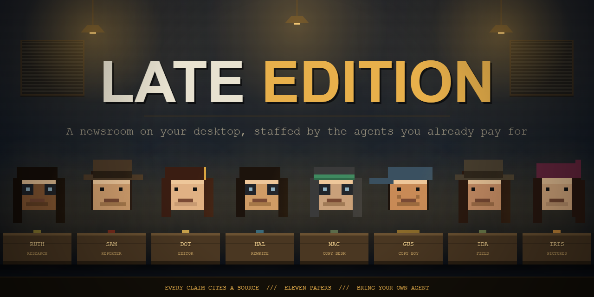
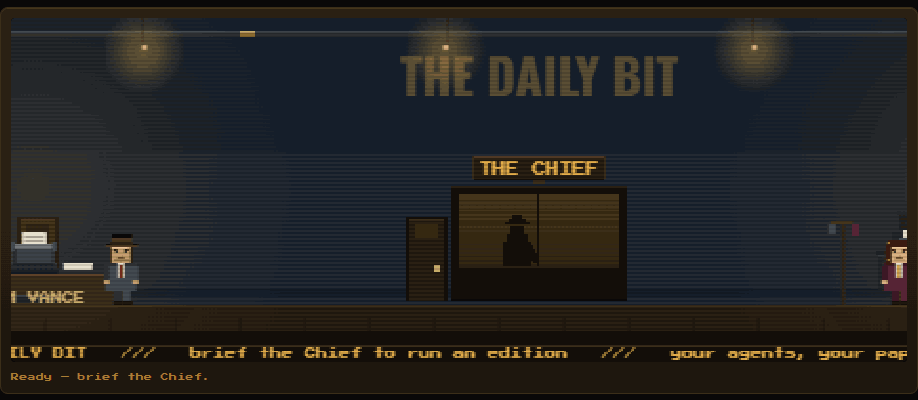

**A newsroom on your desktop, staffed by the AI agents you already pay for.**

[](https://github.com/david-crabtree/late-edition/releases/latest)
[](https://github.com/david-crabtree/late-edition/releases)
[](LICENSE)
[](https://discord.gg/kmr8wqKJJj)
[](https://github.com/sponsors/david-crabtree)

**[Read the wiki](https://github.com/david-crabtree/late-edition/wiki)** for setup, the eleven papers, the art, and everything else.

You brief the Chief with a topic. A researcher digs, reporters file competing angles, an
editor picks the line, the copy desk cuts anything that doesn't stand up, and the presses
run. You get a paper. It runs on the Claude Code or Codex subscription already sitting on
your machine, so an edition costs you nothing you weren't already paying. It talks to the
sources you chose, the agent you already signed into, and GitHub once a day to ask whether
there is a newer version — the
[full list is in the wiki](https://github.com/david-crabtree/late-edition/wiki/Privacy).


## Download

**[Get the latest release →](https://github.com/david-crabtree/late-edition/releases/latest)**

| | |
| --- | --- |
| **Windows** | Installer or portable `.exe`, 64-bit |
| **macOS** | `.dmg`, Intel and Apple Silicon |
| **Linux** | AppImage or `.deb` |

Nothing is code-signed yet, so here is exactly what you will see:

- **Windows** shows a blue "Windows protected your PC" panel. Click **More info**, then
  **Run anyway**. On Windows 11, Smart App Control may block it outright rather than warn.
- **macOS** is ad-hoc signed but not notarised, so the first launch is refused with
  "Apple cannot check it for malicious software". The one-line fix, in Terminal:
  `xattr -cr "/Applications/Late Edition.app"`. Without a terminal: System Settings →
  Privacy & Security → **Open Anyway**, which appears for about an hour after you try.
  (Control-clicking and choosing Open no longer works — Apple removed that on Sequoia.)
- **Linux**: `chmod +x` the AppImage and run it.

Every release publishes `SHA256SUMS.txt`. Nothing being signed, that checksum is the only way
to tell a real download from a tampered one.

**Building it yourself avoids all of that, and on macOS it's the better route** — the
Gatekeeper prompt comes from the quarantine flag your browser attaches to a download, so an
app you built yourself just opens. See [Build from source](#build-from-source).

## Bring your own agent

Late Edition runs no AI itself. Each desk is handed to an agent you have already installed
and signed into, so the work counts against a plan you already have rather than a new bill.

| Agent | Status | Get it |
| --- | --- | --- |
| **Claude Code** | Proven end to end | [Install](https://code.claude.com/docs/en/setup) · needs a Pro, Max, Team or Console account |
| Codex CLI | Written, not yet confirmed live | [developers.openai.com/codex](https://developers.openai.com/codex) |
| Gemini CLI | Written, not yet confirmed live | [geminicli.com](https://geminicli.com) |
| OpenCode | Written, not yet confirmed live | [opencode.ai](https://opencode.ai) |
| Ollama (local models) | Written, not yet confirmed live | [ollama.com](https://ollama.com) |
| Direct API | Written, not yet confirmed live | Any OpenAI- or Anthropic-shaped endpoint |

"Not yet confirmed live" is about our evidence, not missing code. Every one of them is fully
written and wired the same way as Claude Code. If you get one working it should work, and
if it doesn't, [that's worth telling us](https://github.com/david-crabtree/late-edition/issues).

Most of these install from a command rather than a download. The app's Setup panel finds
what you have, gives you the right command for your machine, and opens a terminal already
sitting at it — so you never have to know what a terminal is to get started.

Desks are staffed individually, so you can put a cheap model on research — by far the
hungriest desk — and a strong one on the editor, who makes the call.

## Quick start

1. Install the app and open it. Pick a folder for your newsroom.
2. Open **Setup**, put an agent on each desk. An empty desk stops a run and says so, rather
   than filling the paper with invented copy.
3. Type a topic into **Brief the Chief** and press send.
4. Watch the floor work. Answer the Chief if he asks anything.
5. Read the paper.

## The floor is the progress bar



Most tools that call an agent show you a spinner. This one shows you an office, and the
office is telling you something. When the researcher is digging, Ruth is at her desk typing.
When the editor is choosing between two angles, the camera is on the Chief. The wire ticker
along the bottom carries what the newsroom is thinking, and clicking any staffer opens their
desk log, which is that stage's real output rather than a summary of it.

The look is late-80s point-and-click adventure in a 1930s-40s newsroom: amber lamplight,
blue-black shadow, and one hot red accent held back for **Stop the Press**. All original art,
32 indexed colours, nearest-neighbour only, and every pixel drawn in code — there are no
image assets in the app at all. The full specification, down to frame counts and pivot
points, is in [`docs/art-brief.md`](docs/art-brief.md).

Nine faces work the floor: the Chief, Ruth Ledger on research, Sam Vance reporting, Dot
Banner editing, Hal Brevier on rewrite, Mac Stet on the copy desk, Gus Dash running copy,
Ida Stringer in the field and Iris Plate on pictures.

More in the wiki: [The newsroom floor](https://github.com/david-crabtree/late-edition/wiki/The-newsroom-floor).

## Write it as

The same reporting, filed as eleven different papers. The choice reaches the reporter and
the editor as well as the writer, so what the desk *leads on* moves with it, not just the
wording.

**Papers** — the house style, a red-top, a broadsheet, a business daily, an agency wire.
**Online** — a tech site, a blog post, a newsletter item.
**Social** — a LinkedIn post, a Reddit post.
**Plain** — bullet points, no voice at all.

A red-top leads on whoever the story lands on and puts the price in the first line. The
business daily won't run anything without a figure attached. The wire won't interpret at
all. None of them may bend a fact to suit itself, and the research never changes.

## How an edition is made

Six source adapters feed it, all pure fetch-and-diff with no model anywhere near them:
`rss` · `git_local` · `github` · `web_diff` · `folder` · `ics`. Point them at feeds, a
repository, a competitor's pricing page, a folder, a calendar.

```
WIRE → ASSIGN → TRIAGE → RESEARCH → REPORT → ANGLES → CALL
     → WRITE → CHECK → PROOF → PRESS
```

State is written to disk after every stage, so a run can be resumed or stopped dead.

- **Every claim cites a source or it gets cut.** Agents cite by writing a source's literal
  id. Only real ids become footnotes; invented ones are scrubbed. A story cannot cite a
  source the researcher never found, and anything the copy desk can't stand up is listed
  under Corrections.
- **Competing Takes.** Commission two or three reporters, ideally on different agents. When
  they genuinely disagree the paper runs both instead of quietly picking one.
- **Stop the press.** A corroborated, urgent finding gets promoted to page one.
- **The field desk.** Ida watches the pages a story came from and tells you when one moves.
  Watching costs nothing — no model sees a page until you ask for a follow-up.
- **Standing assignments** run on a cadence and build on their own past coverage.
- **The morgue** is every past edition, searchable, linked into new stories.

`--distribute` sends an approved edition to **Slack**, **Teams**, a **webhook** or an **RSS**
feed, so your team reads it without installing anything. Opt-in; it sends nothing unless
you ask.

## What this is not

Read this before you use anything it writes.

Late Edition lays AI output out as a newspaper. **The newspaper is a presentation style, not
a claim that the contents are true.** No reporter wrote it and no editor checked it.

- **It can be wrong, and it can invent things**, including sources that look real. Every
  edition is an unchecked draft. Verify it against the listed sources before you rely on it,
  republish it, or present it as fact. Every rendered edition carries this notice in the file
  itself, so it travels with the copy.
- **It is not journalism, and it is not advice** of any kind.
- **The usage is yours.** Agents run under your own accounts, against your own plan or key,
  and we can neither see nor cap it.
- **No warranty, no liability.** Free software provided as-is under the [LICENSE](LICENSE).

## Build from source

Node 20 or newer.

```bash
npm ci
npm run app
```

Run an edition headless, with the offline stand-in, spending nothing:

```bash
npm run cli -- init ./my-newsroom
npm run cli -- run --newsroom ./my-newsroom --provider fake
```

The result lands in `my-newsroom/editions/<date>-NNN/` as `edition.md` and `edition.html`.
Its every word is invented — the stand-in contacts no model at all — so use it to watch the
machinery, never to read.

## Privacy

Late Edition runs entirely on your computer. It has no servers, no accounts and no
analytics. The only network traffic is to the sources you configure, to the AI providers you
have already signed in to on your own machine, and to GitHub to ask whether a newer version
exists — which sends nothing about you and which `updates.enabled: false` turns off. What
those providers do with your data is governed by their terms, not ours. Nothing is sent to
David Crabtree, ever.

## Licence

Late Edition is free software under the **GNU Affero General Public License, version 3**.
Use it at home or at work, for any purpose. Read the code, change it, share your changes.
Full terms in the [LICENSE](LICENSE) file.

Two things follow from that licence and the trademark notice, and they are the point:

- **If you distribute it, or run it for other people as a service, you must hand them the
  complete source of what you are running**, under the same licence. There is no version
  of Late Edition you can sell that the buyer cannot then download for free.
- **The name and the characters belong to David Crabtree.** A fork is welcome and must be
  somebody else's newspaper, with somebody else's name on the masthead. See [NOTICE](NOTICE).

It was Apache 2.0 with the Commons Clause until 13 September 2026. Why it changed is in
[`docs/decisions.md`](docs/decisions.md).

## Code signing policy

Only artefacts built by this repository's [release workflow](.github/workflows/release.yml),
from a tagged commit on `main`, are ever submitted for signing. David Crabtree is the sole
author, the reviewer of every outside contribution, and the approver of every signing
request. Two-factor authentication is required on every account with write access.

## Community and support

- **[Discord](https://discord.gg/kmr8wqKJJj)** — help, and a channel for showing off papers.
- **[Discussions](https://github.com/david-crabtree/late-edition/discussions)** — anything that
  should stay searchable.
- **[Issues](https://github.com/david-crabtree/late-edition/issues)** — bugs. An agent changing
  its command line under us is a release blocker.

Late Edition is free and always will be. Nothing is gated and nothing ever will be. If it
earns its keep, [sponsoring it](https://github.com/sponsors/david-crabtree) is welcome and
entirely optional.

## Contributing

See [`CONTRIBUTING.md`](CONTRIBUTING.md). Adding a source adapter or an agent provider is
meant to take a single file. That's a design goal, not an aspiration.

## Credits

Built by [David Crabtree](https://github.com/david-crabtree). All the pixel art is drawn
procedurally in canvas — there are no image assets in the newsroom at all.

---

<p align="center">
Built by <a href="https://github.com/david-crabtree">David Crabtree</a>, on his own time, with nobody's money.<br>
If the paper earns its keep, <a href="https://github.com/sponsors/david-crabtree"><b>buy the newsroom a coffee</b></a> &mdash; one-off or monthly, and nothing is gated either way.
</p>
